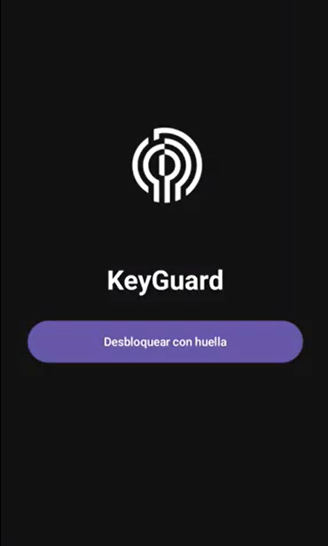
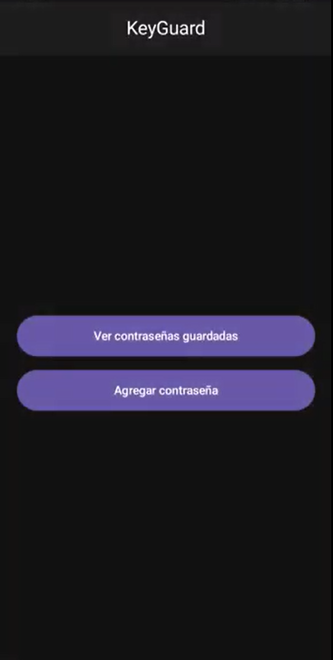
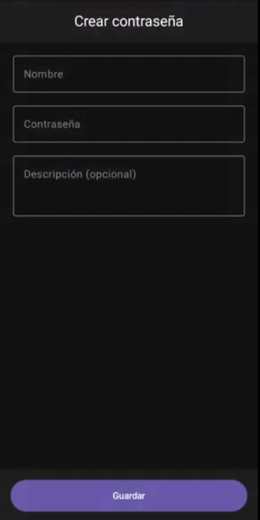
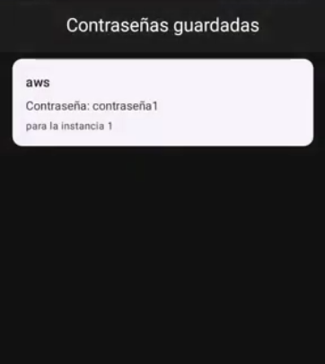

<h1 align="center">
  
  KeyGuard
</h1>

**KeyGuard** es una aplicación móvil diseñada para poder gestionar contraseñas por medios de de seguridad como biometrica, sistema de cifrado y descifrado.

---

##  Tecnologias 

| Componente | Descripción |
|------------|-------------|
| **Lenguaje** | Kotlin |
| **Arquitectura** | MVVM (Model–View–ViewModel) |
| **UI** | Jetpack Compose |
| **Networking** | Retrofit + OkHttp |
| **Testing** | JUnit 4, Mockito, MockWebServer |
| **Seguridad** | Autenticación biométrica, sistema cifrado AES |

---

##  Características actuales

-  Inicio de sesión con autenticación biométrica  
-  Gestión de contraseñas (crear, listar, eliminar)  
-  Organización de contraseñas por carpetas  
-  Consumo de API REST con Retrofit + MockAPI  
-  Manejo de estados con corrutinas y ViewModel  
-  Pruebas unitarias con MockWebServer

---

##  Arquitectura del proyecto

- app/
 - data/
   -  model/ **Modelos de datos (Contrasena, Carpeta, Usuario)**
   -  remote/ **ApiService + RetrofitInstance**
   -  repository/ ** Repositorios de datos**
 - ui/
   -  screens/ **Pantallas Compose**
   -  components/ **Componentes UI reutilizables**
 - viewmodel/ **ViewModels (MVVM)**
 - tests/ **Pruebas unitarias**

---

 Instalación

   Clonar el repositorio:

    git clone https://github.com/tu-usuario/KeyGuard.git

   Abrir el proyecto en Android Studio.

   Ejecutar en un emulador o dispositivo Android.

   Asegurarse de tener Internet para las llamadas a API.

   Sincronizar proyecto con Grandle.

📱 Capturas de pantalla

     

##  Ideas pensadas para futuras versiones:

**Seguridad**

   - Implementar cifrado real de contraseñas antes de guardarlas localmente o enviarlas a la nube.

   - Integrar descifrado seguro antes de mostrar contraseñas en la UI.

**Backend**

   - Integración completa con un backend desplegado (por ejemplo en Render), sin depender solo de MockAPI.

**UI**

   - Modo oscuro responsivo.

   - Animaciones y microinteracciones para mejorar UX.

---

## Estado del proyecto

| Componente | Estado |
|------------|--------|
| Login & autenticación |  Implementado |
| CRUD de contraseñas |  Implementado |
| Cifrado seguro |  En desarrollo |
